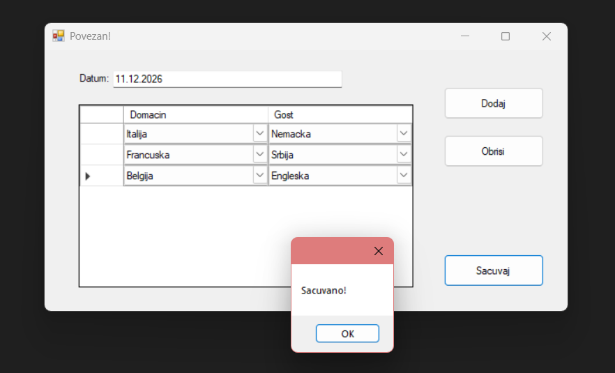
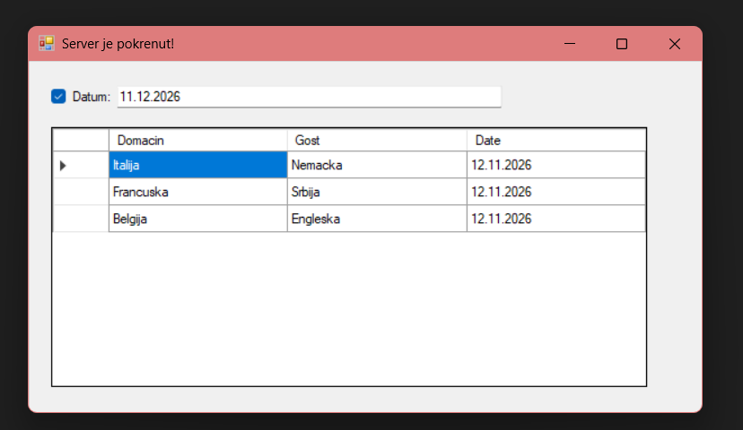

# ⚽ Match Scheduling System

Client-server Windows Forms application for scheduling football matches.

## Description

This project was developed as part of a university coursework.

The application allows users to create and manage match schedules between football teams.
It is implemented as a client-server system using TCP sockets and a SQL Server database.

The client application enables users to:
- Select teams
- Define match dates
- Add and remove matches
- Save match schedules

The server application:
- Processes client requests
- Validates match constraints
- Stores data in SQL Server
- Displays scheduled matches with filtering options

## Technologies Used

- C#
- .NET (Windows Forms)
- TCP Sockets
- SQL Server
- ADO.NET

## System Architecture

The system consists of three main parts:
- ClientApp – User interface and communication with the server
- ServerApp – Request handling and business logic
- Domain – Shared classes (`TransferObject`, `Par`, `Reprezentacija`, `MatchView`)

## Validation Rules

- A team cannot play against itself
- A team can play only one match per day
- Duplicate matches for the same date are not allowed

## How to Run

1. Open the solution in Visual Studio
2. Start `ServerApp`
3. Start `ClientApp`
4. Connect and use the application

## Features

- Add match pairs
- Delete matches
- Save schedule
- Filter matches by date (server side)

## Database

The application uses a SQL Server database with tables:
- `Reprezentacija`
- `Par`

Connection string is defined in `App.config`.

---

## Author

Milica Perovic

Faculty of Organizational Sciences, Belgrade

## Screenshots

### Client Application

### Server Application

